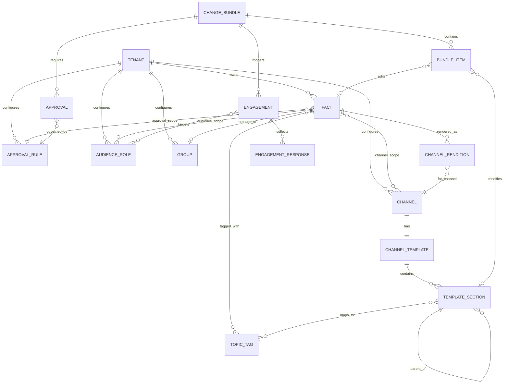

# Core Data Model

## Entity Notes

**TENANT**
One school. Owns its entire corpus and all configuration. Strict data isolation — no cross-tenant visibility at any layer.

**FACT**
The atomic unit of the corpus. A markdown file in git. Carries five independent scope fields: `audience_scope`, `channel_scope`, `approval_scope`, `owner`, and temporal metadata (`publication_date`, `effective_date`, `expiry_date`). Also carries `status` (`stub` or `live`) and an optional `group` reference. Stubs have full metadata but no real content; they block publication on non-optional template sections but not commit. The git log is the version history — no version entity in the application model.

**TOPIC_TAG**
A flat label shared across facts and template sections. The join point between the corpus and document structure. Facts are tagged; sections declare which tags they display. A fact with tags `[dress-code, uniform]` appears in every section that maps to either tag, across all channels.

**CHANNEL**
A named delivery target configured per tenant. Examples: `staff-handbook`, `parent-newsletter`, `event-page`, `chatbot-kb`. Each channel has one template and one LLM transform configuration (tone, style, narrative instructions).

**CHANNEL_TEMPLATE**
The structural definition of a channel's output. Contains an ordered hierarchy of `TEMPLATE_SECTION` nodes. Each section maps to one or more topic tags and carries an `empty_behavior` attribute (`auto-hide` or `show`).

**TEMPLATE_SECTION**
A node in the template hierarchy. Has a depth level (H1/H2/H3), a set of mapped topic tags, and an `empty_behavior`. Self-referencing for parent-child nesting. Facts slot into sections at render time by tag match — not by explicit assignment.

**CHANNEL_RENDITION**
The channel-specific markdown produced by the LLM transform for a given fact and channel. A derived artifact, not the source of truth. Created during the publication flow, after LLM transform and after any human override. What the deterministic renderer consumes.

**CHANGE_BUNDLE**
The unit of change. Always coherent — the coherence gate ensures no bundle enters the approval flow with orphaned facts or broken template structure. Contains fact edits, new facts, and/or template section changes. Carries its own state: `draft`, `pending_approval`, `approved`, `scheduled`, `published`.

**BUNDLE_ITEM**
A single change within a bundle. Targets either a `FACT` (edit, create, revoke) or a `TEMPLATE_SECTION` (add, rename, retag, remove). Polymorphic by design.

**APPROVAL_RULE**
A named rule configured per tenant. Defines the approver chain for a given scope: who must sign off, in what order (sequential or parallel), and whether any approver can veto. Examples: `self-service` (no approvers), `head-of-school`, `legal-sign-off`, `multi-stakeholder`.

**APPROVAL**
One approval instance for a given bundle, governed by the rule derived from the highest-severity approval scope among the facts in the bundle. Tracks approver responses and completion state.

**ENGAGEMENT**
Post-publish engagement configuration for a specific change bundle. Type is either `acknowledgment` or `feedback`. Targets a subset of audience roles. Created at change time, not derived from fact metadata.

**ENGAGEMENT_RESPONSE**
One response per audience member per engagement. Tracks whether the member has acknowledged or submitted feedback, and when. Drives reminder logic and completion rate reporting.

**GROUP**
A named publication bundle defined in tenant config. Holds shared lifecycle metadata (`publication_date`, `effective_date`, `expiry_date`, `approval_scope`, `default_channel_scope`) inherited by all member facts. Per-fact overrides are allowed but flagged. Used for events and any other set of facts with a shared lifecycle. The group is not a fact — it is a configuration entity, consistent with the pattern used for approval rules and audience roles.

## Scope Resolution Rule

When a `CHANGE_BUNDLE` contains facts with different approval scopes, the bundle takes the **most restrictive** approval scope among all included facts. A bundle mixing a `self-service` menu fact and a `legal-sign-off` policy clause requires legal sign-off for the entire bundle.
