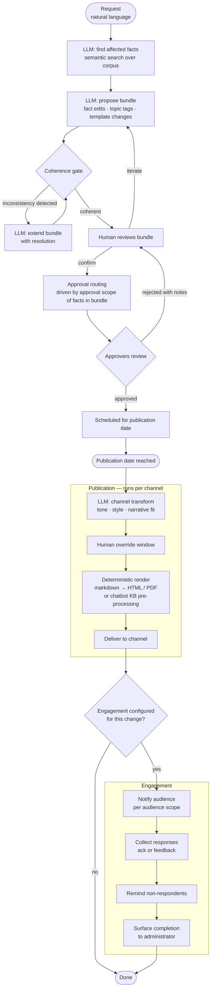

# Change Loop — Workflow Diagram

## Notes

**Coherence gate loop**: the gate does not block — it feeds back into the proposal. The human always sees a coherent bundle. They never resolve inconsistencies manually.

**Iteration vs. rejection**: human iteration (during review) re-enters at the proposal step, keeping the LLM in the loop. Approver rejection re-enters at the human review step, keeping the approver's notes visible.

**Publication is per-channel**: the same approved bundle triggers a separate publication sub-flow for each channel in the facts' channel scope. Each channel has its own LLM transform config and its own human override window.

**Engagement is optional per change**: configured at change time, not as a fixed fact attribute. The same fact might require acknowledgment when a legal clause changes but not when a typo is fixed.
